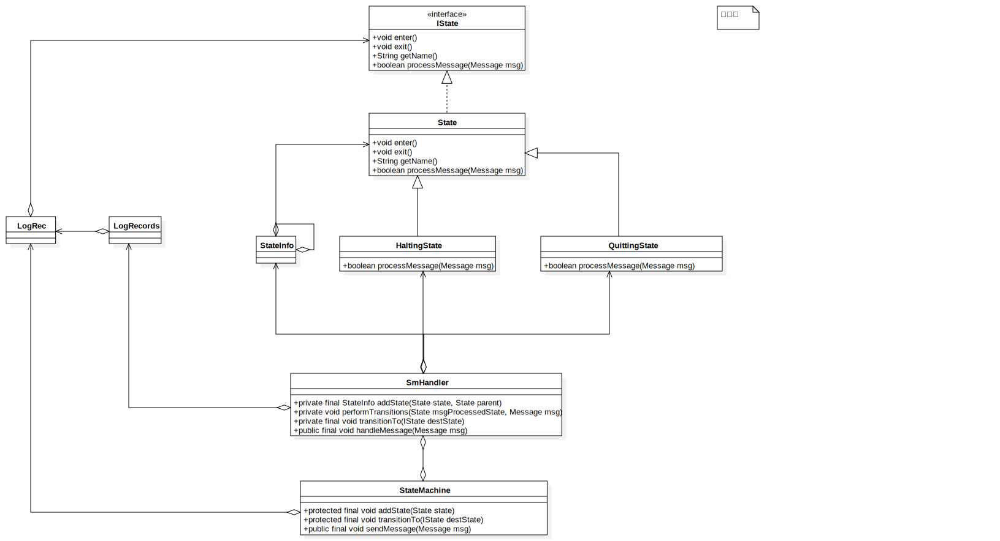

### 概念

[有限状态机](https://zh.wikipedia.org/wiki/%E6%9C%89%E9%99%90%E7%8A%B6%E6%80%81%E6%9C%BA)即FSM，简称状态机，表示有限个状态以及在这些状态之间的转移和动作等行为的数学模型。

状态机可以描述为一个**有向图树**，有一组节点和一组转移函数组成。状态机通过相应一些列事件运行。每个事件都属于当前结点的转移函数的控制范围内，其中函数的范围是一个节点的子集。函数返回下一个节点。这些节点至少有一个终态，到达终态，状态机停止。

### Android StateMachine

Android 系统使用状态机处理不同的状态，可以避免分支语句导致的程序阅读性差以及扩展问题。

#### 使用类



- IState.java 状态接口，每个状态必须实现的接口
    - void enter() 状态进入时调用
    - void exit() 状态退出时调用
    - boolean processMessage(Message msg) 消息处理函数
- State.java 默认实现的IState接口的状态， 需要实现新的状态时，一般只需要集成State重写里面方法即可
- StateInfo.java 状态节点信息，类似链表节点
- StateMachine.java 定义状态层次关系以及状态转换。根据实际需求继承StateMachine，实现自己的状态管理。

> 状态机重点时StateMachine类

#### StateMachine

StateMachine有3个构造函数
```java
    protected StateMachine(String name) {
        mSmThread = new HandlerThread(name);
        mSmThread.start();
        Looper looper = mSmThread.getLooper();

        initStateMachine(name, looper);
    }

    protected StateMachine(String name, Handler handler) {
        initStateMachine(name, handler.getLooper());
    }

    protected StateMachine(String name, Looper looper) {
        initStateMachine(name, looper);
    }

    private void initStateMachine(String name, Looper looper) {
        mName = name;
        mSmHandler = new SmHandler(looper, this);
    }

```

常用的为protected StateMachine(String name)方法创建一个状态机。
mSmThread为HandlerThread,作为消息循环线程
mSmHandler为handler用来处理消息

在状态机维护一个状态数（或者状态层次关系），每个状态的节点信息存储在StateInfo中

#### StateInfo 节点信息

```java
/**
         * Information about a state.
         * Used to maintain the hierarchy.
         */
        private class StateInfo {
            /** The state */
            State state; //节点信息

            /** The parent of this state, null if there is no parent */
            StateInfo parentStateInfo;  //父节点信息

            /** True when the state has been entered and on the stack */
            boolean active; //节点入栈，且已经激活

            /**
             * Convert StateInfo to string
             */
            @Override
            public String toString() {
                return "state=" + state.getName() + ",active=" + active + ",parent="
                        + ((parentStateInfo == null) ? "null" : parentStateInfo.state.getName());
            }
        }
```
与链表区别是：链表中存储的下一个子节点的信息，在状态树节点中存储的不是子节点而是**父节点信息**；有点便于迅速查找父节点，当该节点无法处理此消息时，可以直接转给父节点处理。

#### 状态机的构建

```java
    protected final void addState(State state) {
        mSmHandler.addState(state, null);
    }
```
状态机构建使用addState()方法，addState调用mSmHandler.addState()方法完成整个构建过程。后面会看到状态机的很多工作都是mSmHandler来完成。

```java
        /**
         * Add a new state to the state machine. Bottom up addition
         * of states is allowed but the same state may only exist
         * in one hierarchy.
         *
         * @param state the state to add
         * @param parent the parent of state
         * @return stateInfo for this state
         */
        private final StateInfo addState(State state, State parent) {
            if (mDbg) {
                mSm.log("addStateInternal: E state=" + state.getName() + ",parent="
                        + ((parent == null) ? "" : parent.getName()));
            }
            StateInfo parentStateInfo = null;
            if (parent != null) {
                parentStateInfo = mStateInfo.get(parent);
                //存在父节点，但不在状态树中，添加进来
                if (parentStateInfo == null) {
                    // Recursively add our parent as it's not been added yet.
                    //此处为递归调用
                    parentStateInfo = addState(parent, null);
                }
            }
            //状态不在状态树中，添加进来
            StateInfo stateInfo = mStateInfo.get(state);
            if (stateInfo == null) {
                //将新state包装成StateInfo，存放在map中
                stateInfo = new StateInfo();
                mStateInfo.put(state, stateInfo);
            }

            // Validate that we aren't adding the same state in two different hierarchies.
            //每个状态只能有一个父状态
            if ((stateInfo.parentStateInfo != null)
                    && (stateInfo.parentStateInfo != parentStateInfo)) {
                throw new RuntimeException("state already added");
            }
            //认亲
            stateInfo.state = state;
            stateInfo.parentStateInfo = parentStateInfo;
            stateInfo.active = false;
            if (mDbg) mSm.log("addStateInternal: X stateInfo: " + stateInfo);
            return stateInfo;
        }
```
addState()方法将每个新添加进来的状态封装成StateInfo，添加进状态树中，如果该状态的父节点不在状态树中，递归调用addState()添加进状态树中。
StateInfo存储父节点信息，这样可以通过StateInfo将每个节点联系在一起。状态机中所节点都存储在HashMap<State, StateInfo>()的键值对中，
> 每个状态只能有一个父节点

#### 状态机启动

```java
    /**
     * Start the state machine.
     */
    public void start() {
        // mSmHandler can be null if the state machine has quit.
        SmHandler smh = mSmHandler;
        if (smh == null) return;

        /** Send the complete construction message */
        smh.completeConstruction();
    }

```
start()调用smh.completeConstruction()完成状体机构建

```java
        /**
         * Complete the construction of the state machine.
         */
        private final void completeConstruction() {
            if (mDbg) mSm.log("completeConstruction: E");

            /**
             * Determine the maximum depth of the state hierarchy
             * so we can allocate the state stacks.
             */
            //计算状态树最大深度,用于创建状态树容量
            //状态树记录某个节点到根节点的状态路径，长度不会超过maxDeep
            int maxDepth = 0;
            for (StateInfo si : mStateInfo.values()) {
                int depth = 0;
                for (StateInfo i = si; i != null; depth++) {
                    i = i.parentStateInfo;
                }
                if (maxDepth < depth) {
                    maxDepth = depth;
                }
            }
            if (mDbg) mSm.log("completeConstruction: maxDepth=" + maxDepth);

            //根据状态栈的最大节点数，创建mStateStack，mTempStateStack状态栈
            mStateStack = new StateInfo[maxDepth];
            mTempStateStack = new StateInfo[maxDepth];
            //将状态路径存入状态栈
            setupInitialStateStack();

            /** Sending SM_INIT_CMD message to invoke enter methods asynchronously */
            /*
            状态栈中存储当前节点到根节点的所有状态，根节点位于mStateStack的0位置
             */
            //开启状态数；通过发送SM_INIT_CMD消息，通知状态树可以工作，异步调用enter方法
            sendMessageAtFrontOfQueue(obtainMessage(SM_INIT_CMD, mSmHandlerObj));

            if (mDbg) mSm.log("completeConstruction: X");
        }
```
主要工作
- 遍历状态树中的节点，获取树的最大节点数maxDeep
- 使用栈来记录某个节点到根节点的状态路径，路径不超过maxDeep
- 根据当前节点和树的最大节点数，调用setupInitialStateStack创建两个状态栈
- 初始化完毕，发送SM_INIT_CMD消息，表示状态树构建完成

setupInitialStateStack 填充栈数据
```java
        /**
         * Initialize StateStack to mInitialState.
         */
        private final void setupInitialStateStack() {
            if (mDbg) {
                mSm.log("setupInitialStateStack: E mInitialState=" + mInitialState.getName());
            }

            //根据第一个初始状态
            StateInfo curStateInfo = mStateInfo.get(mInitialState);
            for (mTempStateStackCount = 0; curStateInfo != null; mTempStateStackCount++) {
                mTempStateStack[mTempStateStackCount] = curStateInfo;
                curStateInfo = curStateInfo.parentStateInfo;
            }
            //循环完毕，根节点位于栈顶，初始节点位于栈底

            // Empty the StateStack,清空mStateStack
            mStateStackTopIndex = -1;
            //将temporary stack栈中数据反序添冲到state stack中
            //这是根节点位于栈底(index=0),当前节点位于栈顶
            moveTempStateStackToStateStack();
        }
```

根据当前节点，遍历所有父节点，将当前节点到根节点的信息存储在mTempStateStack中，循环过后当前节点位于栈底（index=0），根节点位于栈顶
调用moveTempStateStackToStateStack将mTempStateStack中树反转存储到mStateStack中。

moveTempStateStackToStateStack 反转数据

```java
        /**
         * Move the contents of the temporary stack to the state stack
         * reversing the order of the items on the temporary stack as
         * they are moved.
         *
         * 将temporary stack栈中数据反序添加到state stack中
         *
         * 在mStateStack已有节点的基础上添加新节点，添加完成当前节点位于栈顶
         *
         * @return index into mStateStack where entering needs to start
         */
        private final int moveTempStateStackToStateStack() {
            //startingIndex 表示mStateStack接受新状态的其实位置，
            //不是每次都从0开始
            int startingIndex = mStateStackTopIndex + 1;
            //mTempStateStack个数
            int i = mTempStateStackCount - 1;
            int j = startingIndex;
            while (i >= 0) {
                if (mDbg) mSm.log("moveTempStackToStateStack: i=" + i + ",j=" + j);
                mStateStack[j] = mTempStateStack[i];
                j += 1;
                i -= 1;
            }

            //invokeEnterMethods 会使用到这个变量
            //新状态栈位置mStateStackTopIndex
            mStateStackTopIndex = j - 1;
            if (mDbg) {
                mSm.log("moveTempStackToStateStack: X mStateStackTop=" + mStateStackTopIndex
                        + ",startingIndex=" + startingIndex + ",Top="
                        + mStateStack[mStateStackTopIndex].state.getName());
            }
            return startingIndex;
        } 
```
当状态处理完毕，发送SM_INIT_CMD，Smhandler从消息队列中取出消息，完成状态机初始化工作

```java
if (!mIsConstructionCompleted && (mMsg.what == SM_INIT_CMD)
     && (mMsg.obj == mSmHandlerObj)) {
        /** Initial one time path. */
        //根据SM_INIT_CMD消息表明构建任务完成，设置完成标志，开始处理消息
        mIsConstructionCompleted = true;
        //循环调用mStateStack中enter方法并将状态设为激活状态
        invokeEnterMethods(0);
     }
```
将mIsConstructionCompleted标记变量设置为true，表示完成初始化，调用invokeEnterMethods，将每个状态设为激活状态，并调用enter()方法

```java
/**
 * Invoke the enter method starting at the entering index to top of state stack
* 从stateStackEnteringIndex开始循环调用mStateStack中enter方法并将状态设为激活状态
*/
private final void invokeEnterMethods(int stateStackEnteringIndex) {
    for (int i = stateStackEnteringIndex; i <= mStateStackTopIndex; i++) {
        if (mDbg) mSm.log("invokeEnterMethods: " + mStateStack[i].state.getName());
            mStateStack[i].state.enter();
             mStateStack[i].active = true;
        }
        //enter 方法是进入状态的必要工作，enter方法执行完，对应状态开始进行消息处理 processMessage
    }
```

#### 状态处理

```java
        /**
         * Handle messages sent to the state machine by calling
         * the current state's processMessage. It also handles
         * the enter/exit calls and placing any deferred messages
         * back onto the queue when transitioning to a new state.
         *
         * 调用当前状态处理消息，
         *
         * 调整更新状态栈stateStack的内容
         */
        @Override
        public final void handleMessage(Message msg) {
            if (!mHasQuit) {
                if (mDbg) mSm.log("handleMessage: E msg.what=" + msg.what);

                /** Save the current message */
                mMsg = msg;

                /** State that processed the message */
                State msgProcessedState = null;
                //构建初始化是否已经完成
                if (mIsConstructionCompleted) {
                    //构建完成，开始处理状态
                    /** Normal path */
                    msgProcessedState = processMsg(msg);
                    //处理完成msgProcessedState，处理完了这个Message以后，将切换到哪个State
                } else if (!mIsConstructionCompleted && (mMsg.what == SM_INIT_CMD)
                        && (mMsg.obj == mSmHandlerObj)) {
                    /** Initial one time path. */
                    //根据SM_INIT_CMD消息表明构建任务完成，设置完成标志，开始处理消息
                    mIsConstructionCompleted = true;
                    //循环调用mStateStack中enter方法并将状态设为激活状态
                    invokeEnterMethods(0);
                } else {
                    throw new RuntimeException("StateMachine.handleMessage: "
                            + "The start method not called, received msg: " + msg);
                }

                //msg处理后，做状态切换，更新mStateStack
                performTransitions(msgProcessedState, msg);

                // We need to check if mSm == null here as we could be quitting.
                if (mDbg && mSm != null) mSm.log("handleMessage: X");
    }
}
```
状态机构建完成，调用processMsg()处理该状态，状态处理完毕，调用performTransitions完成状态树的更新

```java
        /**
         * Process the message. If the current state doesn't handle
         * it, call the states parent and so on. If it is never handled then
         * call the state machines unhandledMessage method.
         *
         * 调用当前状态处理消息，如果当前状态没有处理调用该状态的父状态处理，
         * 如果最后都没有处理，调用unhandledMessage方法
         *
         * @return the state that processed the message 处理了该消息的状态
         */
        private final State processMsg(Message msg) {
            //获取栈顶状态，当前所处的状态
            StateInfo curStateInfo = mStateStack[mStateStackTopIndex];
            if (mDbg) {
                mSm.log("processMsg: " + curStateInfo.state.getName());
            }

            if (isQuit(msg)) {
                //SM_QUIT_CMD消息，切换到mQuittingState状态
                transitionTo(mQuittingState);
            } else {
                //调用当前状态机处理
                while (!curStateInfo.state.processMessage(msg)) {
                    /**
                     * Not processed
                     没有处理调用父状态处理
                     */
                    curStateInfo = curStateInfo.parentStateInfo;
                    if (curStateInfo == null) {
                        /**
                         * No parents left so it's not handled
                         */
                        mSm.unhandledMessage(msg);
                        break;
                    }
                    if (mDbg) {
                        mSm.log("processMsg: " + curStateInfo.state.getName());
                    }
                }
            }
            //返回最后成功处理了Message的那个状态，如果没有，那么就是返回null
            return (curStateInfo != null) ? curStateInfo.state : null;
        }
```
- 如果接受到是SM_QUIT_CMD消息，切换到mQuittingState状态，退出状态机
- 调用当前状态处理，如果当前状态没有处理，没有处理调用父状态处理
- 如果所有的状态都没有处理该消息，调用mSm.unhandledMessage

#### 状态树切换

```java


        /**
        * transition to destination state. Upon returning
        * from processMessage the current state's exit will
        * be executed and upon the next message arriving
        * destState.enter will be invoked.
        *
        * this function can also be called inside the enter function of the
        * previous transition target, but the behavior is undefined when it is
        * called mid-way through a previous transition (for example, calling this
        * in the enter() routine of a intermediate node when the current transition
        * target is one of the nodes descendants).
        *
        * @param destState will be the state that receives the next message.
        */
        protected final void transitionTo(IState destState) {
            mSmHandler.transitionTo(destState);
        }

        /**
         * Do any transitions
         *
         * performTransitions来检查状态切换，为状态数跟新
         *
         * @param msgProcessedState is the state that processed the message
         */
        private void performTransitions(State msgProcessedState, Message msg) {
            /**
             * If transitionTo has been called, exit and then enter
             * the appropriate states. We loop on this to allow
             * enter and exit methods to use transitionTo.
             */
            State orgState = mStateStack[mStateStackTopIndex].state;

            /**
             * Record whether message needs to be logged before we transition and
             * and we won't log special messages SM_INIT_CMD or SM_QUIT_CMD which
             * always set msg.obj to the handler.
             */
            boolean recordLogMsg = mSm.recordLogRec(mMsg) && (msg.obj != mSmHandlerObj);
            //记录处理过的消息
            if (mLogRecords.logOnlyTransitions()) {
                /** Record only if there is a transition */
                if (mDestState != null) {
                    mLogRecords.add(mSm, mMsg, mSm.getLogRecString(mMsg), msgProcessedState,
                            orgState, mDestState);
                }
            } else if (recordLogMsg) {
                /** Record message */
                mLogRecords.add(mSm, mMsg, mSm.getLogRecString(mMsg), msgProcessedState, orgState,
                        mDestState);
            }

            //mDestState,具体状态调用transitionTo(State)时传入的参数
            //具体状态在重写processMessage时，调用transitionTo(state)方法，设置下一步要切换的状态
            State destState = mDestState;
            if (destState != null) {
                /**
                 * Process the transitions including transitions in the enter/exit methods
                 */
                while (true) {
                    if (mDbg) mSm.log("handleMessage: new destination call exit/enter");

                    /**
                     * Determine the states to exit and enter and return the
                     * common ancestor state of the enter/exit states. Then
                     * invoke the exit methods then the enter methods.
                     *
                     * 获取从destState到还没有active的父节点，
                     * mTempStateStack存储是新的终止节点和
                     * 旧终止节点的公共节点与新的终止节点的一段状态树
                     */
                    StateInfo commonStateInfo = setupTempStateStackWithStatesToEnter(destState);
                    invokeExitMethods(commonStateInfo);

                    //stateStackEnteringIndex 需要调用enter方法的状态在mStateStack中位置
                    int stateStackEnteringIndex = moveTempStateStackToStateStack();

                    //从stateStackEnteringIndex位置开始调用状态栈中state的enter并将active设为true
                    invokeEnterMethods(stateStackEnteringIndex);

                    /**
                     * Since we have transitioned to a new state we need to have
                     * any deferred messages moved to the front of the message queue
                     * so they will be processed before any other messages in the
                     * message queue.
                     *
                     * 转换新状态后，将之前的延迟消息移动到消息队列的头部，使得延迟消息的处理早于其他消息
                     */
                    moveDeferredMessageAtFrontOfQueue();

                    if (destState != mDestState) {
                        // A new mDestState so continue looping
                        destState = mDestState;
                    } else {
                        // No change in mDestState so we're done
                        break;
                    }
                }
                mDestState = null;
            }

            /**
             * After processing all transitions check and
             * see if the last transition was to quit or halt.
             */
            if (destState != null) {
                if (destState == mQuittingState) {
                    /**
                     * Call onQuitting to let subclasses cleanup.
                     */
                    mSm.onQuitting();
                    cleanupAfterQuitting();
                } else if (destState == mHaltingState) {
                    /**
                     * Call onHalting() if we've transitioned to the halting
                     * state. All subsequent messages will be processed in
                     * in the halting state which invokes haltedProcessMessage(msg);
                     */
                    mSm.onHalting();
                }
            }
        }
```
- 调用transitionTo转换状态，在调用mSmHandler.transitionTo()设置目的状态，当消息处理完毕后变调用performTransitions做真正的状态调整，主要是调整状态栈的节点信息
- 根据新的目的节点，调用setupTempStateStackWithStatesToEnter()，查找到根节点没有被激活的状态，这些节点存储在mTempStateStack中，并得到新目的节点和旧目的节点公共节点commonStateInfo
- 根据commonStateInfo，调用invokeExitMethods()，将需要移除栈的节点的状态设为false，并调用exit方法
- 调用moveTempStateStackToStateStack将mTempStateStack节点反转存储到mStateStack中，这样**当前目的节点位于栈顶**，下次处理消息时直接调用当前设置的目的节点
- 调用invokeEnterMethods方法，将新添加的节点状态设为true，并调用enter方法
- 在切换状态后，如果存在消息没有处理，调用moveDeferredMessageAtFrontOfQueue将延迟消息存放在消息队列的头部

#### 状态机的退出

```java
    /**
     * Quit the state machine after all currently queued up messages are processed.
     */
    protected final void quit() {
        // mSmHandler can be null if the state machine is already stopped.
        SmHandler smh = mSmHandler;
        if (smh == null) return;

        smh.quit();
    }
```
调用SmHandler的quit方法
```java

        /** @see StateMachine#quit() */
        private final void quit() {
            if (mDbg) mSm.log("quit:");
            sendMessage(obtainMessage(SM_QUIT_CMD, mSmHandlerObj));
        }
```
processMsg处理消息时判断时退出消息，调用transitionTo(mQuittingState)，切换到QuittingState状态，做状态机退出工作


### 具体消息的处理

```java 
    //蓝牙关闭状态
    private class OffState extends State {
        @Override
        public void enter() {
            infoLog("Entering OffState");
        }

        @Override
        public boolean processMessage(Message msg) {
            AdapterService adapterService = mAdapterService;
            if (adapterService == null) {
                errorLog("Received message in OffState after cleanup: " + msg.what);
                return false;
            }

            debugLog("Current state: OFF, message: " + msg.what);

            switch(msg.what) {
                //初始状态是OffState，由OffState处理蓝牙开启操作
               case BLE_TURN_ON:
                   //通知BluetoothmangerService蓝牙正在开启
                   notifyAdapterStateChange(BluetoothAdapter.STATE_BLE_TURNING_ON);
                   mPendingCommandState.setBleTurningOn(true);
                   transitionTo(mPendingCommandState);
                   //发送延迟消息，检测打开超时任务
                   sendMessageDelayed(BLE_START_TIMEOUT, BLE_START_TIMEOUT_DELAY);
                   //批量启动 profile service
                   adapterService.BleOnProcessStart();
                   break;

               case USER_TURN_OFF:
                   //TODO: Handle case of service started and stopped without enable
                   break;

               default:
                   return false;
            }
            return true;
        }
    }

```
当蓝牙关闭状态收到BLE_TURN_ON消息时，表示蓝牙执行打开操作，发出通知表示正在执行打开操作，调用transitionTo将目的状态切换到mPendingCommandState，由mPendingCommandState处理后续的状态，并开启打开任务的超时检测；调用BleOnProcessStart，启动所需要的蓝牙服务；服务启动后通过StateMachine的sendMessage()会发送BLE_STARTED消息，mSmHandler调用processMsg()，该消息由mPendingCommandState处理。

### 总结

StateMachine在初始化时会创建一个HandleThread，用来处理维护消息队列。
通过addState方法创建一个层次状体树，所有这些节点将存储在HashMap<State,StateInfo> mStateInfo中，
调用setInitialState方法设置初始状态；调用start方法开始创建状态栈，使得初始状态位于栈顶，这样处理消息时，直接交给栈顶节点处理。状态栈构建完成将所有栈中的节点设为true，并执行enter方法，表示状态可以进入工作。然后向状态机发送SM_INIT_CMD消息，由状态机处理该消息。如果状态机构建完成，这是消息由当前的节点处理，如果当前节点不能处理交由父节点处理，所有节点都不能处理处理，调用状态机的unhandledMessage方法（这个方法一般由具体状态机实现），消息处理了返回true，没有处理返回false。
如果在处理消息时调用transitionTo设置新目的状态，消息处理完成后，performTransition方法会设置调整状态栈的节点信息，这样新的节点设置在栈顶，消息来消息时直接调用栈中取出，处理消息。
推出状态机调用quit或quitNow，向状态机发送SM_QUIT_CMD消息，处理后续的事情。

### 参考
- http://ju.outofmemory.cn/entry/145718
- http://blog.csdn.net/yangwen123/article/details/10591451